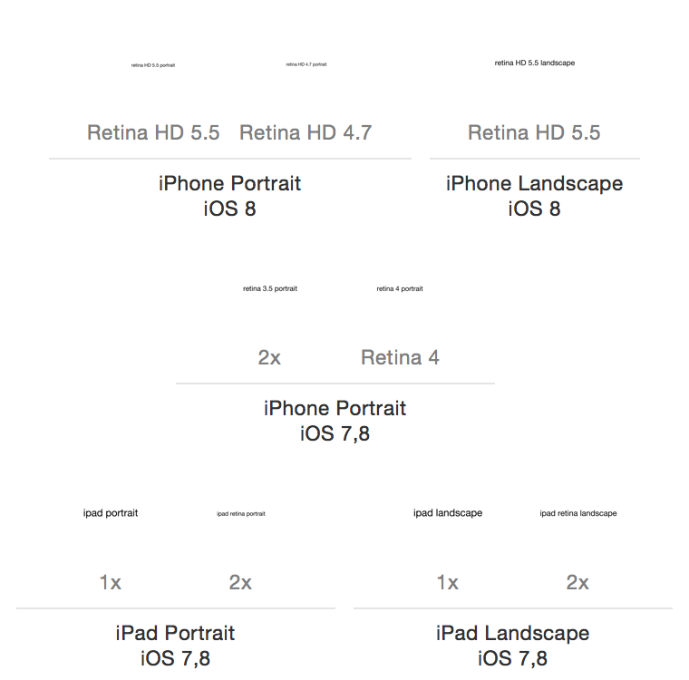

launchImageBlanks
=================

Launch image placeholders for iOS 8 devices, in an Xcode asset catalog. Just drop the included `LaunchImage.launchimage` directory into your desired `.xcassets` catalog and you'll have all the necessary sizes of launch images that can then be edited in your favorite image editing software. Here's what you'll get out of the box:

